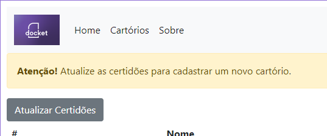
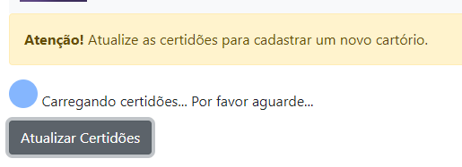
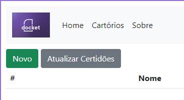

## Java Docket Test
Neste teste para a área de desenvolvedor Backend, à partir do briefing e requisito apresentados, a Docket propõe a você construir um sistema de cartórios e o planejamento do seu projeto.

### Tecnologias Utilizadas

- Java 8 (ou superior) ✔️
- Spring Boot ✔️
- Thymeleaf HTML ✔️
- Banco de dados H2DB ✔️

### Fluxo Cartório:

### Sistema de Cartórios:

#### Obs.: fluxo e caso de usos criados via Creatly

### Consumo da API Externa - Certidões
#### Para criar um cenário onde houvesse o consumo da API no teste, introduzi um fluxo de atualização de certidões para reproduzir o caso de uso desenhado acima, onde é necessário que o sistema carregue primeiramente as certidões e salve no banco de dados local, para então poder utilizarmos nos cadatros de cartórios. 

#### Ao atualizar as certidões, o sistema libera a opção para cadastrar um novo cartório.

### Client API Rest
#### O client interno ficou desenvolvido na classe "RegistryOfficeApiController", com o prefixo "api/" nas rotas. 
#### Confesso que não sabia se era o melhor cenário dentro da arquitetura do Java Spring Boot, mas foi o que encontrei mais sentido na hora de desenvolver.

## Considerações Finais
- Tenho consciência de que é possível melhorar muita coisa referente a template engine, mas por ser o primeiro contato foi bastante interessante explorar o Thymeleaf!
- O mesmo vale para o Java em si (igualmente o Spring Boot). Encontrei algumas similaridades com o PHP/Laravel, mas no geral foi bem legal e um grande aprendizado!
- Agradeço muito pela oportunidade!